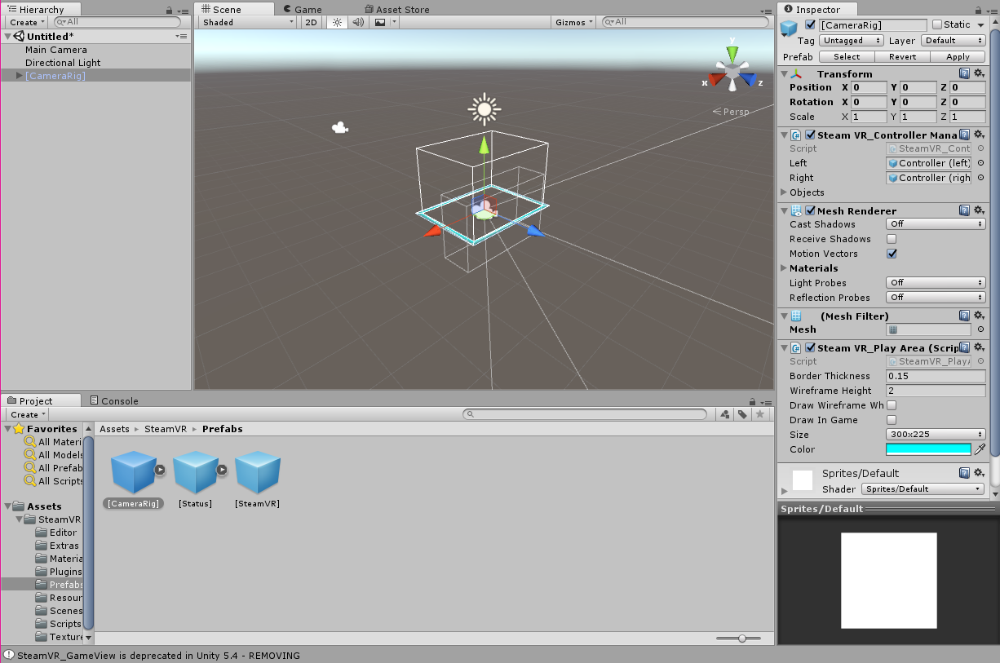
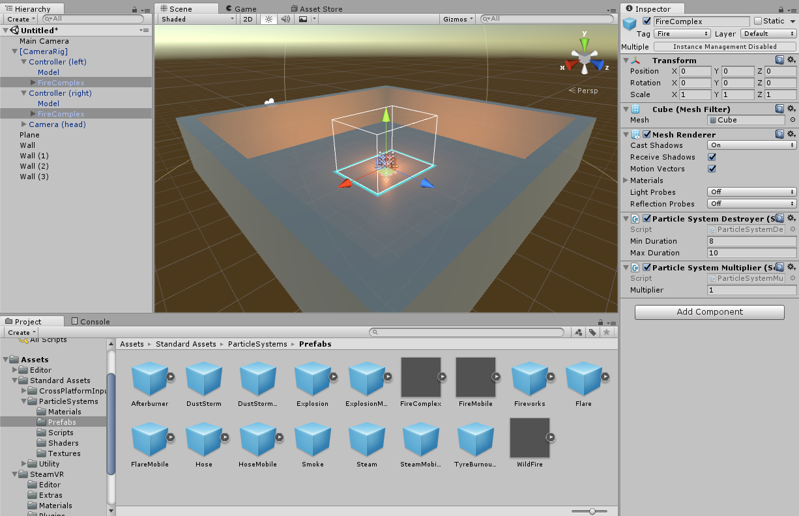
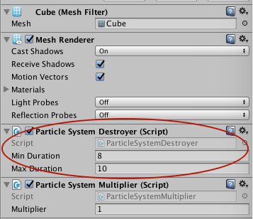
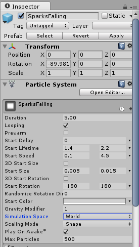
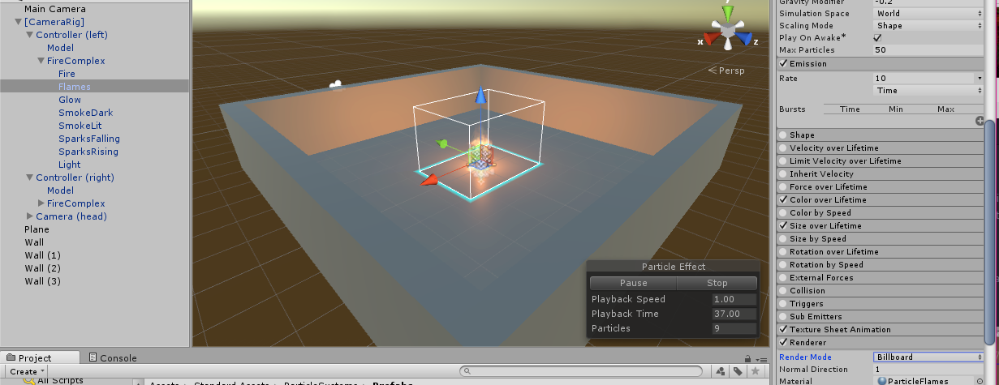

Today we are going to learn to turn our hands into balls of fire so we can dance around a little space with flaming fire hands.

>[action]
>Create a new 3D Unity Project and set the Scene by adding a plane. Make sure you put the plane at (0,0,0)

Now we are going to need to import SteamVR into the project so that we can get the hand controllers and control our HMD.

>[action]
>Open the Asset Store, search for SteamVR, and Download and import it.

<!-- -->

>[action]
>Click the "import" button to import once it downloads, and then "accept all" of the default settings. Unity should congratulate you for this wise decision.

The glowing blue box will be your walking play area. You will be able to walk around this region and interact with objects inside of it.

>[action]
>From the SteamVR/Prefabs folder add a Camera Rig Prefab.

The blue box represents the recommended walking area. This is the area within which your player should stay to avoid bumping into walls in the real world.

>[action]
>Add a plane to be the ground.

>[action]
>Next build 4 walls, so please make 4 cubes and align them around the plane to give yourself 4 walls to be inside of.  We are going to do this so that we can have our lighting appear on the walls when we swing the fire around.

>[info]
>You may notice in our images, by the way, that a SteamVR Prefab has been added to our hierarchy as well. This is a Prefab that will get automatically added to your Scene when you run it, but we've chosen to add it manually. For the purposes of this tutorial, there is no significant advantage to adding the Prefab manually. The only significant advantage you would gain by adding the SteamVR prefab is the ability to reference it or change values on it in the Inspector, but this tutorial does not do any of those things; we have simply added it out of habit.

<!-- -->

>[action]
>Now delete the Main Camera from your Scene.  We don't want it here, because the Prefab we dragged in already has a camera! If you leave this camera in, Unity will yell at you for having two Audio Listeners in your Scene. More importantly, you really don't want the old camera, because it's not connected to your HMD anyway!

#Bring in the Fire

We're going to get a cool fire effect to put on our hands from the Standard Assets. In order to do this next step, you will have needed to download Standard Assets when you downloaded Unity. If you don't remember whether or not you did, you probably did, because it should have been the default for you.

>[action]
>Import Standard ParticleSystem Assets (Assets->Import Package->ParticleSystem, and then click the "import" button).

>[action]
>Next delete the directional light from the scene so it’s dark, and add the FireComplex particle system (Standard Assets/ParticleSystems/Prefabs) to each of your hands. Be sure to set the local position of the FireComplex object to be (0,0,0)!

We are going to modify this particle system to make it look a little more realistic.

>[action]
>Before we modify how it looks though, let's modify how it acts. Remove the Particle System Destroyer component from the FireComplex.

The Particle System Destroyer script makes the fire disappear after a few seconds, and we don't want that! That's why we took it off.

>[action]
>Open the FireComplex particle system and change the SparksFalling section to use World Space instead of Local Space.

This makes the Particles not be parented to the hand. When Particles are parented to an object, they'll move with it, and that looks unrealistic for fire, which only spawns where an object is, but floats up, independent of the spawner's motion.

>[action]
>Actually, change all of the different subsystems to use World Space (this means the particles will stay stationary when you move your hand instead of following your hand)

Next we are going to make the actual fire texture have a higher emission rate, and **Billboard** differently, so it looks more realistic while you move it around.

>[info]
>Billboarding refers to the way an object faces. To Billboard means to always face the camera, like an old-school sprite from Doom 1.

<!-- -->

>[action]
>Please change these settings to this (Emission Rate = 10, Max Particles = 50, Render Mode = Billboard):

>[action]After you are done copy and paste the finished version of FireComplex into your other hand.

<!-- -->

>[action]
>Now lets run and test..

You should have two fireballs hanging in your hands that you can wave around! Really cool huh!

That is it!

If you'd like to try a challenge to extend this project, try any of the following:

- Make the fire shift through the colors of the rainbow!
- Make the fire emit faster or slower depending on how quickly you move your hands
- Make the fire briefly light the ground whenever it touches it!
- Put the fire at the ends of chains you can swing around from your hands like [fire poi](https://en.wikipedia.org/wiki/Poi_(performance_art))!  (This one's pretty challenging! We weren't able to make one we liked ourselves!)
